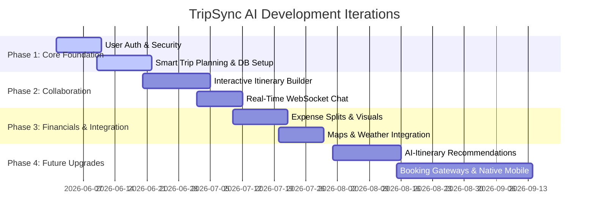

# RoamMate 🌍 — Product Feature Roadmap

This roadmap establishes the implementation phases, detailing the execution timeline for the core product features and future strategic enhancements of **RoamMate 🌍**.

---

## 📍 Execution Timeline Matrix

---

## 🗺️ Detailed Phase Breakdown

### 🎯 Phase 1: Core Foundation & Secure Setup (Milestone 1)
* **Goal**: Establish a robust authentication pipeline and base trip logging logic.
* **Key Features**:
  * **JWT Auth Layer**: Secure signup, login, password hashing (BCrypt), stateless validation, and profile management page.
  * **Smart Trip Planning**: Basic trip creation flow (setting name, date range, destinations).
  * **Data Architecture**: Migrate database tables for users, trips, and memberships using SQL Flyway scripts (`V1` & `V2`).

---

### 💬 Phase 2: Live Collaboration & Dynamic Timelines (Milestone 2)
* **Goal**: Enable real-time dynamic schedules and instant group communication.
* **Key Features**:
  * **Interactive Itinerary Builder**: Visual, drag-and-drop timeline builder displaying activities hour-by-hour.
  * **Live WebSocket Chat**: Group chat rooms syncing through WebSocket handlers allowing members to share plans instantly.
  * **Real-time Collaboration**: WebSocket push signals trigger automatic UI updates when a friend appends a new destination or activity.

---

### 📊 Phase 3: Expense Splitting & API Integrations (Milestone 3)
* **Goal**: Build out advanced calculators and enrich the workspace with geographic context.
* **Key Features**:
  * **Expense Tracking Engine**: Input bills, classify categories (food, transit, tickets), and select individual member split rules.
  * **Visual Financial Dashboard**: Render dynamic pie and bar charts illustrating group spending.
  * **Interactive Maps**: Integrate Google Maps API to visualize routes, calculate travel distance, and locate pinned activities.
  * **Weather Forecast Widget**: Leverage OpenWeather API to render real-time temperature forecasts for selected travel dates.

---

### 🚀 Phase 4: Future Strategic Enhancements (Milestone 4)
* **Goal**: Harness AI recommendations, expand to mobile apps, and integrate transaction gateways.
* **Key Features**:
  * **🤖 AI-Generated Itineraries**: Let users supply trip preferences (budget, interest, duration) and query an AI engine to draft a rich, customized itinerary template.
  * **🏨 Booking Engine Integration**: Connect with travel APIs to book flights, hotels, and transport directly in-app.
  * **📱 Native Mobile Application**: Develop React Native wrappers for iOS and Android, taking advantage of push notifications and location services.
  * **📶 Offline Synchronization Mode**: Local SQL storage caches itinerary data, allowing travelers to view route schedules while in low-signal zones, auto-syncing updates when connection resumes.
