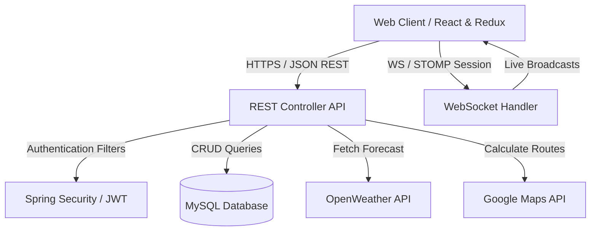

# RoamMate 🌍 — System Overview & Architecture Blueprint

## 📖 Introduction
**RoamMate 🌍** is a collaborative, real-time travel planning platform designed to unify every aspect of trip planning into a single, cohesive experience. From mapping out complex daily itineraries to managing shared expenses and communicating with fellow travelers, RoamMate replaces fragmented workflows with a modern, high-performance web app.

---

## 🎯 Platform Objectives

The primary goal of TripSync AI is to solve the complex coordination problems that arise during group travel planning by focusing on four major pillars:

1. **Intuitive Scheduling**: Replacing disorganized notes and documents with a visual, interactive, day-wise timeline.
2. **Fair Financials**: Automating shared expense tracking and splitting calculations to remove group tension.
3. **Instant Synchronicity**: Providing a low-latency collaborative state where group changes are synchronized instantly.
4. **Interactive Discovery**: Seamlessly embedding weather projections, route maps, and place explorer insights into the user workflow.

---

## 💡 Problem Statement
Planning trips manually using disjointed tools for budgeting, messaging, navigation, and calendar scheduling causes severe user fatigue. Common friction points include:
* **Coordination Gaps**: Misaligned schedules and loss of updates across multiple group members.
* **Debt Tracking Complexity**: Manually logging and dividing bills during travel.
* **Information Fragmentation**: Jumping between mapping apps, chat clients, and weather websites.

**TripSync AI** solves this by establishing a **centralized collaborative source of truth**.

---

## 🏗️ Architectural Topology

The platform uses a classic, decoupled full-stack architecture optimized for low-latency synchronization:

---

## 🧱 Detailed Module Responsibilities

### 🖥️ 1. Frontend Client Module
* **State Management**: Uses Redux Toolkit to maintain state across pages, caching user profiles, active itineraries, and expense records.
* **Visual Experience**: Leverages Framer Motion to create sleek, glassmorphic hover effects, responsive drawer views, and smooth slide-in page transitions.
* **Real-time Sync**: Establishes a STOMP-over-WebSocket connection to listen for collaborative trip updates and chat room broadcasts.

### ⚙️ 2. Backend API Service Module
* **Auth Pipeline**: Standardizes security using Spring Security and JWT filters. Validates requests and maintains stateless user sessions.
* **WebSocket Broker**: Configures sub-protocol connections to manage collaborative channels, dispatching travel update payloads to online members.
* **Logic & Integration**: Validates business rules (e.g., budget caps, overlapping trip dates) and maps external API payloads (Google Maps, OpenWeather) to internal DTO models.

### 💾 3. Database Persistence Module
* **MySQL Schema**: Manages strict relational structures with optimized index keys for fast retrievals.
* **Migration Lifecycle**: Utilizes Flyway database migrations to handle structured table updates seamlessly (`db/migration/`).

---

## 🏆 Advantages of TripSync AI

* **Centralization**: Combines the power of splitwise, WhatsApp, Google Maps, and calendar schedulers into a unified app.
* **Instant Sync**: Real-time itinerary state changes broadcast via WebSocket handlers.
* **Secure and Robust**: Industry-standard Spring Security integration with JWT validation.
* **Aesthetic Superiority**: Built with a dark glassmorphic design language, micro-animations, and fluid transitions.
* **Scalable & Modular**: Modular architecture dividing clear responsibilities between frontend components, Spring Services, and migrations.

---

## 🏁 Expected Outcomes
Upon full deployment, **TripSync AI** will deliver a professional, seamless travel portal. Users will experience zero planning anxiety, gain clear oversight of their financial footprint, and interact inside a beautiful, live-updated space that turns cooperative travel planning into a joyful part of the journey itself.
